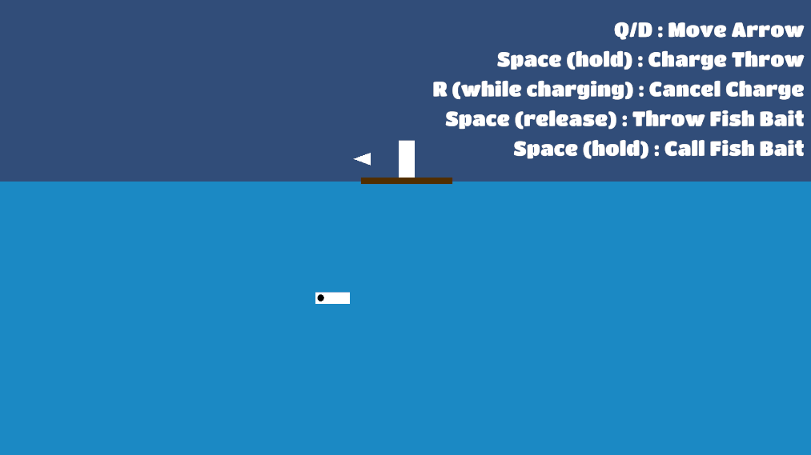
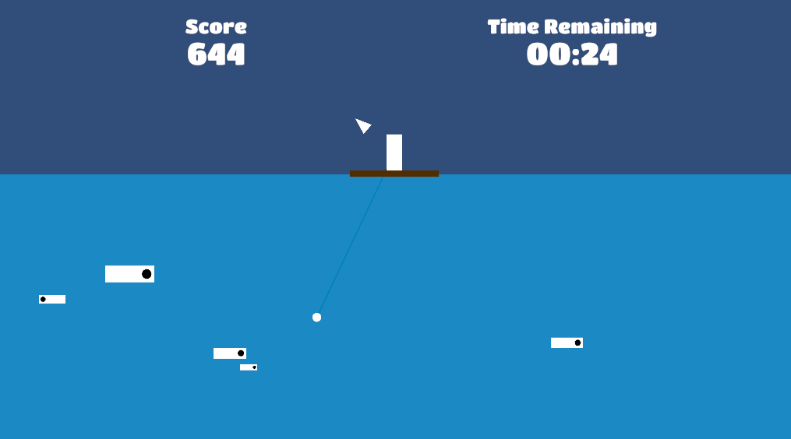
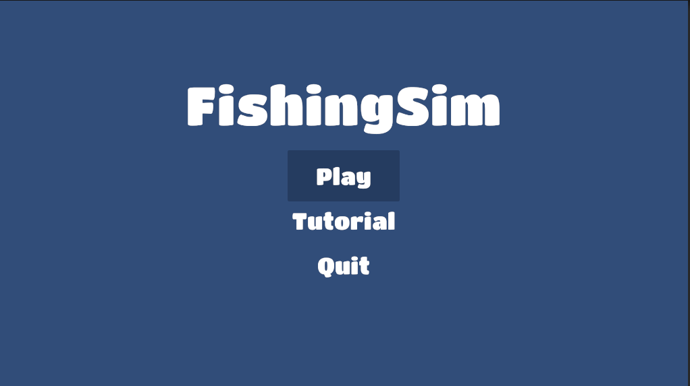
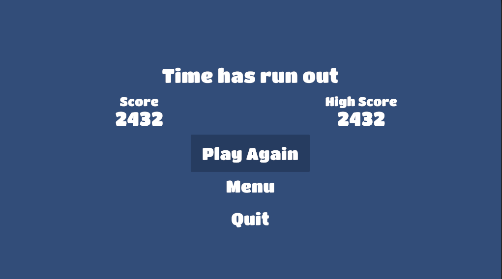

# FishingSim

FishingSim is a minimalist fishing simulation game where the player has one minute to catch as many fish as possible and achieve the highest score. This project was developed by Yohan Francois and Steeven Novo, students at Télécom SudParis.

## Table of Contents
- [Overview](#overview)
- [Features](#features)
- [Requirements](#requirements)
- [Controls](#controls)
- [Game Rules](#game-rules)
- [Credits](#credits)

## Overview
FishingSim presents a simple yet engaging challenge: catch fish within a limited time. The more fish the player catches, the higher their score. The goal is to beat one's personal best or compete with friends.

## Features
- **Game Duration**: 1-minute gameplay to aim for the highest score.
- **Scoring**: The score increases based on the fish caught.
- **Multi-Control Support**: Playable with keyboard, mouse, or controller.
- **Intuitive UI**: Displays score, remaining time, and an endgame screen with options to replay, return to the menu, or quit.

## Requirements
- **Platform**: Windows

## Controls
The game can be played using the keyboard, mouse, or a controller. Key controls include:

- **Cast the line**: Click with the mouse or use the dedicated button on the controller.
- **Move the line**: Use arrow keys or the controller joystick.

## Controls
FishingSim is playable with both keyboard/mouse and a controller. Here are the key actions:

- **Aim the Cast**  
  - **Keyboard/Mouse**: Q and D
  - **Controller**: Left Joystick  
  Use this to direct where the fishing line will be cast.

- **Charge the Cast**  
  - **Keyboard/Mouse**: Hold Space
  - **Controller**: Hold RT  
  Hold to build up power for the cast. The longer you hold, the farther the line will go.

- **Cancel the Charge**  
  - **Keyboard/Mouse**: R
  - **Controller**: Circle or B (depending on the controller)  
  Press this to cancel the charge and reset the line if you change your mind.

- **Release the Cast**  
  - **Keyboard/Mouse**: Release Space
  - **Controller**: Release RT  
  Let go to cast the fishing line.

- **Reel in the Line**  
  - **Keyboard/Mouse**: Hold Space
  - **Controller**: Hold RT  
  Use this to reel in the line and try to catch a fish once the line is in the water.

## Game Rules
The player must catch as many fish as possible within one minute. Once the time runs out, an endgame screen shows the final score, the highest score achieved, and options to replay, go back to the main menu, or quit.

## Visual Overview
Here are some screenshots of FishingSim:

- **Gameplay Screen**  
  

- **Main Menu**  
  

- **Endgame Screen**  
  

## Credits
- **Developers**: Yohan Francois, Steeven Novo
